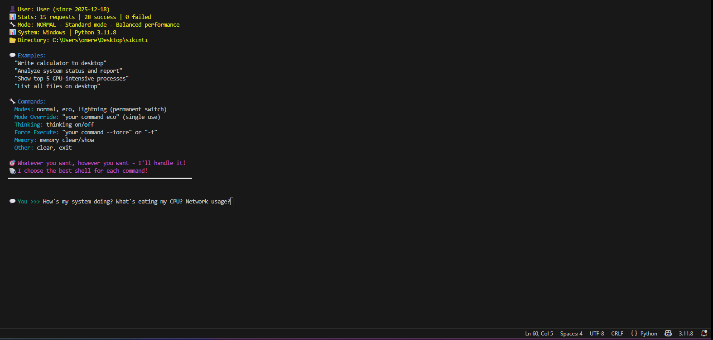

# ZAI Shell

**The AI terminal assistant that actually fixes its own mistakes.**

Most AI tools give up when something fails. ZAI doesn't. It analyzes errors, switches shells, tries different encodings, and keeps going until it works.



---

## ⚡ Quick Install (2 Minutes)

```bash
# 1. Install dependencies
pip install google-generativeai colorama psutil

# Optional: For advanced features
pip install chromadb transformers torch accelerate

# 2. Get free API key from https://aistudio.google.com/app/api-keys

# 3. Set environment variable
# Windows (PowerShell):
$env:GEMINI_API_KEY="your_key_here"

# Linux/Mac:
export GEMINI_API_KEY="your_key_here"

# 4. Run ZAI
git clone https://github.com/TaklaXBR/zai-shell.git
cd zaishell
python zaishell.py
```

**[📖 Detailed installation guide below](#-installation-2-minutes)**

---

## 🎯 Why Choose ZAI?

### The Problem with Other AI Assistants

**Traditional AI Assistant:**
```
You: "Create a file with Turkish characters: şğüçöı"
AI: [runs command]
Error: UnicodeDecodeError
AI: "Sorry, there was an error. Please try again."
You: 😤 Manual debugging needed
```

**ZAI:**
```
You: "Create a file with Turkish characters: şğüçöı"

ZAI: [tries UTF-8]
Error: Encoding issue
🔧 Auto-switching to CP850...
Error: Still wrong
🔧 Auto-switching to CP1254...
✓ Success!

You: ✓ File created perfectly, zero manual intervention
```

---

## 📊 ZAI vs Competition

| Feature | ZAI Shell | ShellGPT | Open Interpreter | GitHub Copilot CLI | AutoGPT |
|---------|-----------|----------|------------------|-------------------|---------|
| **Self-Healing Retry** | ✅ 5-attempt auto-fix with different strategies | ❌ Manual retry | ❌ Manual retry | ❌ Manual retry | ⚠️ Autonomous but loop-prone |
| **Thinking Mode** | ✅ Toggle AI reasoning display | ❌ Black box | ❌ Black box | ❌ Black box | ⚠️ Self-feedback only |
| **Persistent Memory** | ✅ ChromaDB vector search + JSON fallback | ✅ Chat sessions only | ✅ Session-based | ⚠️ Session context only | ✅ Long-term with platform |
| **Multi-Mode System** | ✅ Eco/Lightning/Normal + temporary override | ❌ Single mode | ❌ Single mode | ⚠️ Model selection | ❌ Single platform |
| **Safety Controls** | ✅ --safe (blocks dangerous), --show (preview), --force (skip confirm) | ❌ Basic confirmation | ⚠️ Unsafe auto-run mode | ✅ Approval-based | ⚠️ Fully autonomous risk |
| **Offline Mode** | ✅ Full local AI (Phi-2) with GPU/CPU support | ❌ API only | ❌ API only | ❌ API only | ❌ API/Platform only |
| **Shell Intelligence** | ✅ 13 shells: CMD, PowerShell, PWSH, Git Bash, WSL, Cygwin, Bash, Zsh, Fish, Ksh, Tcsh, Dash, Sh | ✅ Cross-shell | ✅ Multi-language runtime | ✅ Terminal native | ❌ Platform-focused |
| **Smart Path Correction** | ✅ Auto-converts Desktop/ to real user paths | ❌ Manual paths | ✅ Full system access | ⚠️ Repository-aware | ⚠️ Platform-dependent |
| **Installation** | ✅ 2 commands | ✅ `pip install` | ⚠️ Docker/setup required | ⚠️ Auth + npm required | ❌ Complex Docker platform |
| **Cost** | ✅ Free tier friendly + offline mode | ⚠️ API costs | ⚠️ API costs | ⚠️ Paid subscription only | ❌ High API + platform costs |
| **Local Execution** | ✅ Direct terminal access | ✅ Terminal-based | ✅ Full system access | ✅ Repository integration | ⚠️ Platform/Server-based |

### Real-World Performance

**Stress Test Results (44 Tasks):**
- ✅ **95.45% success rate** (42/44 completed)
- ✅ **100% success** in file operations, code generation, system info
- ✅ **Auto-retry up to 5 times** with different strategies per attempt
- ✅ **Zero critical errors** - handles failures gracefully
- ❌ Only 2 failures due to API quota limits (not ZAI errors)

**What This Means:**
```
Traditional AI: "List all Python files"
└─ Error → You manually fix → Retry → Maybe works

ZAI: "List all Python files"
└─ Error → Auto-switches encoding → Error → Tries different shell → Error → Changes command approach → Success ✓
    Time: 22.8 seconds | Your effort: Zero | Retry attempts: 3/5
```

---

## ✨ Key Features

### 🔧 Self-Healing Auto-Retry (Upgraded to 5 Attempts)
When commands fail, ZAI automatically:
- Analyzes errors (encoding, permissions, wrong shell, command syntax)
- Switches between shells (PowerShell ↔ CMD ↔ bash ↔ Git Bash ↔ WSL)
- Changes encoding (UTF-8 → CP850 → CP1254)
- Tries completely different command approaches
- Attempts up to **5 times** with different strategies each time

**Real Example:**
```bash
You: "What OS am I on and what's my Python version?"

Attempt 1: [CMD] Get OS info
└─ ❌ FINDSTR: Cannot open Adı"

🔧 Switching to PowerShell...

Attempt 2: [PowerShell] Get OS info
└─ ✅ Success!
      [PowerShell] Get Python version
└─ ❌ Python not found in PATH

🔧 Trying py launcher...

Attempt 3: [CMD] Use py launcher
└─ ✅ Success! Python 3.11.8
```

### 🐚 Universal Shell Support (13 Shells)

ZAI supports the most comprehensive shell ecosystem. It automatically selects the best shell for each task or uses multiple shells in a single request.

| **Windows Ecosystem** | **Linux/Unix Ecosystem** |
|-------------------|----------------------|
| • **CMD** (Standard) | • **Bash** (Standard Linux) |
| • **PowerShell** (Management) | • **Zsh** (MacOS Default) |
| • **PWSH** (Cross-platform) | • **Fish** (User-friendly) |
| • **WSL** (Linux Subsystem) | • **Sh** (Basic Shell) |
| • **Git Bash** (Unix on Win) | • **Ksh, Tcsh, Dash** |
| • **Cygwin** (Unix Tools) | |

---

#### 🚀 Real-World Example: Cross-Shell Orchestration

**The Task:**
> *"Using WSL, create a file on Desktop. Use CMD to write text. Use PowerShell to compress it. Finally, delete original with WSL."*

**The Result:**


✅ **ZAI seamlessly orchestrates:** `WSL` → `CMD` → `PowerShell` → `WSL`
⏱️ **Performance:** 4 shells, 4 actions, **6.77 seconds**, zero manual intervention.

### 🧠 Thinking Mode
See exactly how ZAI solves problems:
```bash
thinking on   # Show AI's reasoning process
thinking off  # Hide thinking for faster responses
thinking      # Check current status
```

Example output:
```
🧠 Thinking Process:

1. User Intent: "Analyze system performance" - needs CPU, memory, disk
2. Security Assessment: Read-only operations, safe to proceed
3. Method Selection: PowerShell Get-Process for rich data
4. Shell Selection: PowerShell for Windows integration
5. Plan: Top 5 CPU → Top 5 memory → Disk usage
6. Potential Issues: Large output → limit results to top 5
7. Alternative Approaches: If fails, try CMD with tasklist

⚡ Executing 3 action(s)...
```

### ⚡ Three Speed Modes with Temporary Override

| Mode | Model | Best For | Speed | Token Usage |
|------|-------|----------|-------|-------------|
| **Lightning** | gemini-flash-lite (Temp 0.1) | Maximum speed, no explanations | ⚡⚡⚡ (1.90s) | Ultra-low |
| **Eco** | gemini-flash-lite (Temp 0.3) | Token-efficient with command chaining | ⚡⚡ (1.99s) | Low |
| **Normal** | gemini-flash (Temp 0.7) | Highest accuracy and detail | ⚡ (3.01s) | Standard |

```bash
# Permanent mode switch
lightning
eco
normal

# Temporary mode override (single command)
"organize my desktop files" eco
"create complex Python script" normal
"delete temp files" lightning
```


*Lightning mode: 48 PDFs organized into desktop folder in 3.34 seconds*

### 🌐 Offline Mode (NEW!)
Run ZAI completely locally without internet:

**Features:**
- Uses Microsoft Phi-2 (2.7 billion parameters)
- Automatic GPU (CUDA) or CPU detection
- First-time model download (~5GB)
- Privacy-focused: Your data never leaves your machine
- No API costs, no rate limits

**Usage:**
```bash
switch offline    # Enable offline mode (downloads model if needed)
switch online     # Return to API mode

# Offline mode automatically uses:
# - GPU if available (RTX, GTX cards)
# - CPU if no GPU (slower but works)
```

### 💾 Persistent Memory with Vector Search
**Dual memory system:**

**ChromaDB (Vector Memory):**
- Semantic search in conversation history
- Find related topics even with different words
- Example: Search "calculator" finds math-related conversations

```bash
memory search "web scraper"     # Finds all scraping conversations
memory search "system analysis" # Finds performance checks
```

**JSON Fallback:**
- Automatic fallback if ChromaDB not installed
- Stores last 50 conversations
- Usage statistics

**Memory Commands:**
```bash
memory          # Show statistics
memory show     # View recent history
memory search "query"  # Semantic search (ChromaDB only)
memory clear    # Reset history
```

### 🛡️ Advanced Safety Controls
**Three security flags:**

**--safe / -s** (Blocks dangerous commands)
```bash
"delete all files" --safe
# ⛔ BLOCKED: 'rm -rf' detected - dangerous operation
```

Blocks: `rm -rf`, `format`, `reboot`, `shutdown`, `dd if=`, `chmod 777`, `mkfs`, fork bombs, and more.

**--show** (Preview without executing)
```bash
"organize desktop" --show
# Shows: What will be done
# ├─ Create folder: Organized_2025
# ├─ Move 45 files
# └─ Rename 12 duplicates
# ⚠️ No actions executed
```

**--force / -f** (Skip confirmation)
```bash
"delete temp files" --force
# Executes immediately without asking
```

### 📁 Advanced File Operations with Smart Path Correction
**Smart Path Fix:**
- Automatically converts `Desktop/file.txt` → `C:\Users\YourName\Desktop\file.txt`
- Works with `Documents/`, `Downloads/`, etc.
- Handles both forward and backslashes

**Supported Operations:**
- Any file type (.py, .txt, .md, .json, .csv, .html, .css, .js, .pdf)
- Auto-detects best encoding
- Creates parent directories automatically
- Handles special characters in any language
- Binary and text mode support

### 💻 Multi-Task Execution
Execute multiple operations in one request:
```bash
You: "Analyze system and save report to desktop"

⚡ Executing 5 action(s)...
[1/5] [PowerShell] Create report file... ✓
[2/5] [PowerShell] Get CPU processes... ✓
[3/5] [PowerShell] Get memory stats... ✓
[4/5] [PowerShell] Get disk usage... ✓
[5/5] [PowerShell] Get network info... ✓

📊 Result: 5/5 successful
⏱️ 15.39 seconds
```

### 🎨 Code Generation
Generate code in any language with automatic file creation:
- Python, JavaScript, HTML/CSS
- Bash, PowerShell, Batch
- C++, Java, Rust, Go
- And more

```bash
"Write a web scraper that saves to CSV"
→ ✓ Created scraper.py (145 lines with error handling)

"Create a calculator webpage with modern design"
→ ✓ Created calculator.html (HTML + CSS + JS inline)

"Generate a PowerShell script to backup user files"
→ ✓ Created backup.ps1 (75 lines with logging)
```

### 🔍 Intelligent JSON Parsing
**Surgical JSON Extractor:**
- Counts brackets mathematically `{ }` to find valid JSON
- Extracts JSON even if AI adds extra text
- Handles `<thinking>` tags and explanations gracefully
- Never fails due to formatting issues

---

## 📥 Installation (2 Minutes)

### Prerequisites
- Python 3.8+
- Internet connection (for online mode)

### Quick Setup

**1. Install core dependencies:**
```bash
pip install google-generativeai colorama psutil
```

**2. Optional dependencies for advanced features:**
```bash
# For ChromaDB vector memory (recommended)
pip install chromadb

# For offline mode (AI runs locally)
pip install transformers torch accelerate
```

**3. Get free Gemini API key:**
- Visit: https://aistudio.google.com/app/api-keys
- Create API Key

**4. Set environment variable:**

**Windows (PowerShell):**
```powershell
$env:GEMINI_API_KEY="your_key_here"

# Permanent:
[System.Environment]::SetEnvironmentVariable('GEMINI_API_KEY', 'your_key_here', 'User')
```

**Linux/Mac:**
```bash
export GEMINI_API_KEY="your_key_here"

# Permanent:
echo 'export GEMINI_API_KEY="your_key_here"' >> ~/.bashrc
source ~/.bashrc
```

**5. Run ZAI:**
```bash
git clone https://github.com/TaklaXBR/zai-shell.git
cd zaishell
python zaishell.py
```

---

## 📋 Command Reference

### Mode Control
```bash
normal          # Balanced mode (gemini-2.5-flash, Temp 0.7)
eco             # Token-efficient (gemini-flash-lite, Temp 0.3)
lightning       # Maximum speed (gemini-flash-lite, Temp 0.1)

# Temporary mode override for single command
"your command" eco
"your command" lightning
"your command" normal
```

### Network Mode
```bash
switch offline  # Use local AI model (Phi-2)
switch online   # Use Gemini API
```

### Thinking Mode
```bash
thinking on     # Show AI reasoning
thinking off    # Hide reasoning
thinking        # Check status
```

### Memory Management
```bash
memory          # Show statistics
memory show     # View recent history
memory search "query"  # Semantic search (requires ChromaDB)
memory clear    # Reset conversation history
```

### Safety Flags
```bash
--safe, -s      # Block dangerous commands
--show          # Preview actions without executing
--force, -f     # Skip confirmation prompts
```

### Other Commands
```bash
clear, cls      # Clear screen
exit, quit      # Exit ZAI
```

---

## 🐛 Known Limitations

- Offline mode requires ~5GB download for first use
- Offline mode is slower on CPU (GPU recommended)
- Non-English characters: 95% success with 5-retry system
- Thinking mode can be verbose in Normal mode (use Lightning for speed)
- Force mode bypasses all safety checks
- Gemini free tier has rate limits (use eco mode or offline mode)
- ChromaDB memory requires separate installation

---

## 🗺️ Roadmap (v7.x Vision)

Upcoming features planned for the next major release:

- [ ] **Hybrid GUI & CLI Workflow:** Integration of grid-based visual control (ZAI Auto) to handle tasks requiring mouse/keyboard interaction alongside shell commands.
- [ ] **Visual Error Analysis:** Screenshot-based analysis of GUI states and error outputs using multimodal model input.
- [ ] **Remote Terminal Sharing:** Collaborative terminal sessions for pair programming and remote debugging.
- [ ] **Live Web Search:** Fallback to web search for up-to-date documentation on errors.

> *Have a feature request? Open an issue to discuss!*

---

## 🤝 Contributing

**Ways to help:**
- 🐛 Report bugs via GitHub issues
- 💡 Suggest features
- 🔧 Submit pull requests
- 📝 Improve documentation
- 🌍 Add support for more shells

**Good first issues:**
- Add Nushell/Fish configuration examples
- Improve encoding detection for other languages
- Create automated test suite
- Add code templates for common tasks
- Optimize offline model performance

---

## 📝 License

**GNU Affero General Public License v3.0**

---

## 📧 Contact

**Creator:** Ömer Efe Başol (15, learning AI and Python)  
**Email:** oe67111@gmail.com  
**GitHub:** [TaklaXBR](https://github.com/TaklaXBR)

---

<div align="center">
⭐ <strong>If ZAI saved your terminal session, give it a star!</strong> ⭐
</div>
